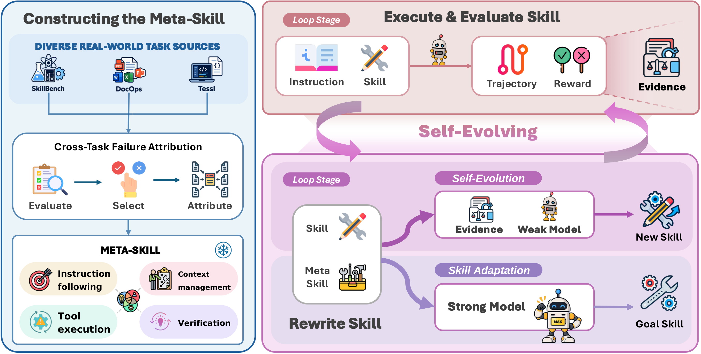

<div align="center">


# Evolving to Match Capabilities

### Improving Harness Self-Evolution via Skill Adaptation

[Zhihao Yang](https://zhihaoyang30.github.io/)\*, [Haojin Wang](https://haojinw0027.github.io/)\*, [Juncheng Wu](https://chtholly17.github.io/)\*, [Kuan Zhang](https://itheresaapocalypse.github.io/), [Yukun Chen](https://scholar.google.com/citations?user=JWxSJVgAAAAJ&hl=zh-CN), [Run Luo](https://rainbowluocs.github.io/),
[Yaojie Lu](https://yaojie.lu/), [Yuyin Zhou](https://yuyinzhou.github.io/), [Lu Wang](https://openreview.net/profile?id=~Lu_Wang26)†, [Xianpei Han](https://scholar.google.com/citations?user=pA88bm4AAAAJ&hl=en)†

<sub>\* equal contribution &nbsp;·&nbsp; † corresponding authors</sub>

<br>

[](https://zhihaoyang30.github.io/skill-adaptation/)
[](https://zhihaoyang30.github.io/skill-adaptation/paper.pdf)
[](https://zhihaoyang30.github.io/skill-adaptation/#video-sec)

</div>

---

> **TL;DR** — The same agent skill can lift a strong model while sinking a weaker one. We diagnose why, distill the diagnosis into a fixed **meta-skill** that rewrites skills to match the executor, and show it improves both one-shot **skill adaptation** and five-round **harness self-evolution** — across all seven executors.

## 💡 The Problem

Across **seven models** spanning three capability tiers, well-crafted skills improve
GPT-5.6-luna by **+31.1 score points**, yet reduce Gemma-4-E4B's score by **−8.8 points**.

In **86% of failed weak-model runs, the violated requirement is already stated in the skill** —
effective guidance depends on *how* instructions are organized and presented, not just what they say.

## 🧰 The Method

We analyze recurring failures in **instruction following**, **context management**, **tool
execution**, and **verification**, and distill these findings into a **meta-skill** — a fixed
rewriting protocol for adapting skills to the executor. We then integrate this protocol into
**harness self-evolution**, where agents iteratively revise their skills from execution
trajectories and verifier feedback.



## 📊 Key Results

Evaluated on **103 skill-sensitive task–skill pairs**, screened from 607 pairs across
**SkillsBench · DocOps · Tessl**:

| Setting                                                      | Result                                                       |
| ------------------------------------------------------------ | ------------------------------------------------------------ |
| **One-shot skill adaptation** (Kimi-K3 rewrites, no execution evidence) | **+5.1 ~ +14.1** points over the original skills, for all three weak executors |
| **Five-round self-evolution** (each model rewrites its own skill) | **+2.0 ~ +5.1** points over the same loop without the meta-skill, across **all seven executors** |

**Takeaways**

1. Through skill adaptation, a capable rewriter turns human-crafted skills that weak models could not use into skills they can use effectively.
2. Distilling executor failure modes into a meta-skill improves skill adaptation by providing explicit guidance on what to revise and how.
3. Given evidence of failure, weak models can use the meta-skill to self-evolve better skills, ending above self-evolution without it.

## 🔗 Explore

- **Interactive project page** (clickable figures, animated demos): https://zhihaoyang30.github.io/skill-adaptation/
- **Paper**: [paper.pdf](https://zhihaoyang30.github.io/skill-adaptation/paper.pdf)
- **Code**: coming soon
- **arXiv**: coming soon

## 📖 Citation

```bibtex
@article{yang2026evolving,
  title  = {Evolving to Match Capabilities: Improving Harness Self-Evolution via Skill Adaptation},
  author = {Yang, Zhihao and Wang, Haojin and Wu, Juncheng and Zhang, Kuan and Chen, Yukun
            and Luo, Run and Lu, Yaojie and Zhou, Yuyin and Wang, Lu and Han, Xianpei},
  year   = {2026}
}
```
